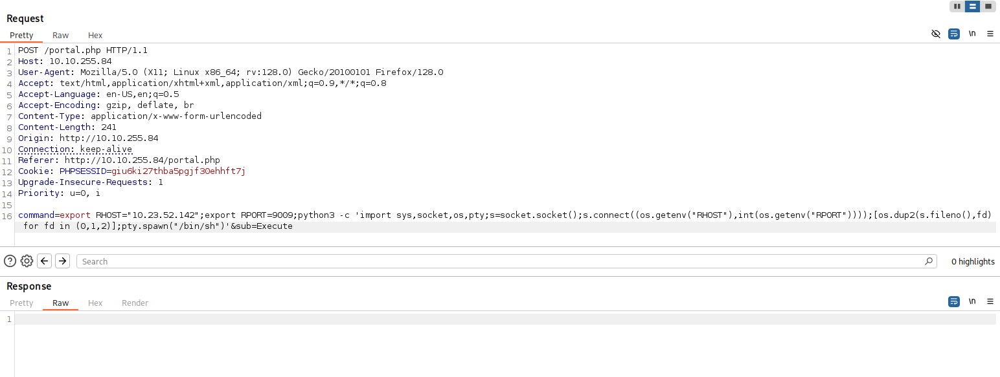

# Artificial

## Machine Info


## Port Scanning

```bash
nmap -T4 -A -p- --min-rate 1000 --open -oN port_scan.txt 10.10.11.74

Nmap scan report for 10.10.11.74
Host is up (0.037s latency).
Not shown: 65533 closed tcp ports (reset)
PORT   STATE SERVICE VERSION
22/tcp open  ssh     OpenSSH 8.2p1 Ubuntu 4ubuntu0.13 (Ubuntu Linux; protocol 2.0)
| ssh-hostkey: 
|   3072 7c:e4:8d:84:c5:de:91:3a:5a:2b:9d:34:ed:d6:99:17 (RSA)
|   256 83:46:2d:cf:73:6d:28:6f:11:d5:1d:b4:88:20:d6:7c (ECDSA)
|_  256 e3:18:2e:3b:40:61:b4:59:87:e8:4a:29:24:0f:6a:fc (ED25519)
80/tcp open  http    nginx 1.18.0 (Ubuntu)
|_http-title: Did not follow redirect to http://artificial.htb/
|_http-server-header: nginx/1.18.0 (Ubuntu)
```


## Web Enumeration

Change the /etc/hosts file to allow the visualization of the web page.

```bash
sudo nano /etc/hosts

10.10.11.74     artificial.htb
```

Registering to the website we'll moving to upload file page login.

<figure><figcaption></figcaption></figure>


