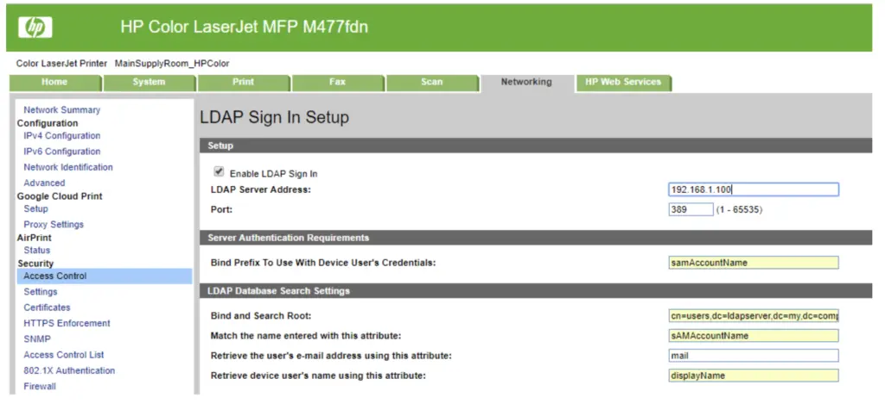
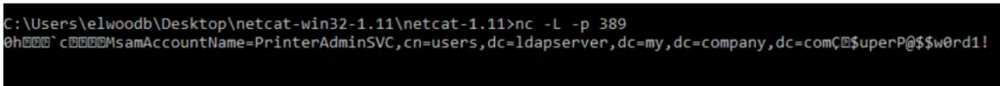

# Pass-Back Attack (MFP LDAP Credential Harvesting)

A **Pass-Back Attack** is a technique used during a penetration test to steal network credentials from a **multi-function printer (MFP)** that uses **LDAP** for login or address book lookup. Many printers are connected to Active Directory and send credentials to an LDAP server to verify users. If you can access the printer’s settings, you can **change its LDAP server to your own machine** and trick the printer into sending you credentials.

**When to use it:**

* During **internal network testing**.
* When you find a **printer with an open web interface** or **default credentials**.
* If the printer is connected to LDAP/Active Directory.

This method can give you **valid usernames and passwords** or **NTLM hashes**, which may help you move deeper into the network or access other services.


## Step-by-Step

### Find MFP target

The first step will be find a MFP with **web interface** and with **default credentials.**

Then, check if the LDAP or SMTP are configured.


### Setup listener for capture

Now we have to start a listener on our machine that will capture the data from MFP device.

```bash
nc -lvvp 389
```


### Change Server IP on MFP configs

When we have setup the listener, we have to change the LDAP configuration with out IP address. In this way, the traffic from MFP will be redirect to our machine.

<figure><figcaption></figcaption></figure>

### Use data captured

When we have captured data like those:

<figure><figcaption></figcaption></figure>

We can use them for:

* Pass the received NTLM hash to internal SMB/LDAP services (Pass-the-Hash).
* Kerberoast if SPNs are exposed.
* Pivot further—many MFPs also cache SMB share creds for “scan-to-folder”.


## Resources&#x20;


